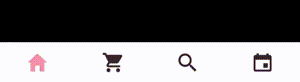

# RN_Animation

Attempt to replicate UX designs I saw online using React Native. 

### Experiments with 'react-navigation-shared-element library'
Example 3: the design from [Stano Bagin](https://dribbble.com/shots/7378780-Travel-App-Trip-Detail-Animation) \

Example 3: took design from [this beautiful design by Dimest](https://dribbble.com/shots/5529409-Photography-Motion) \

### Experiments with tab bar animation
Example 2: I don't remember where I first saw the design \

Example 3: \

Example 4: \

Example 5: \
